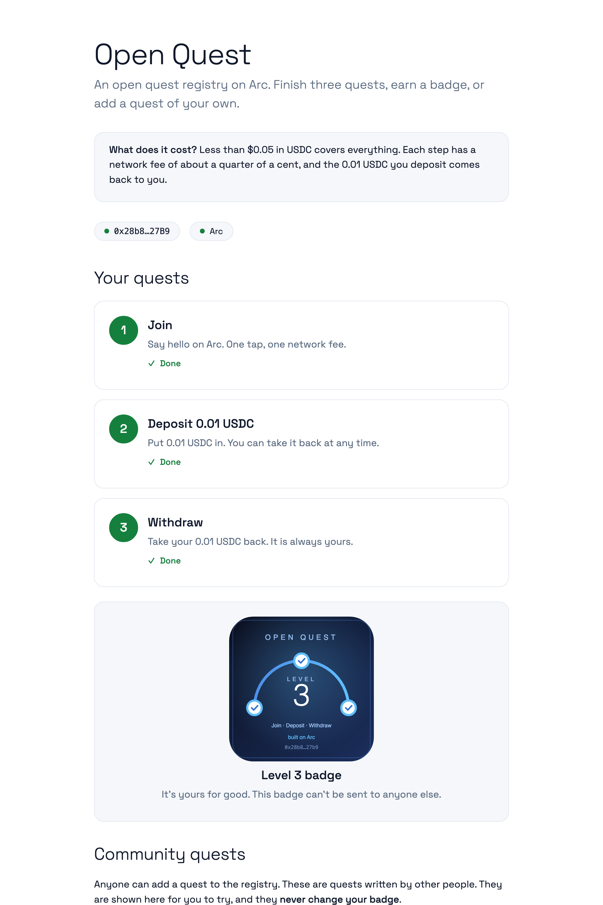
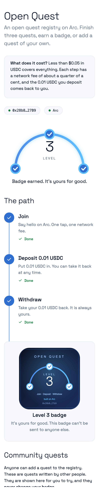
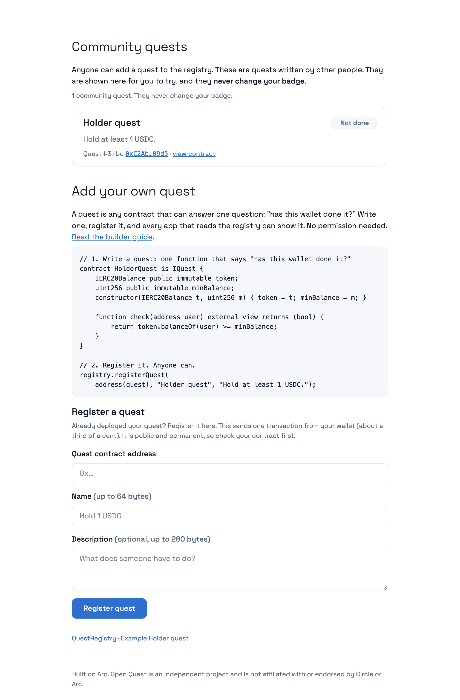

# Open Quest

**An open quest registry on Arc.** A newcomer finishes three quests and earns a soulbound badge. Anyone can add their own quest to the registry in about 10 lines of Solidity, with no permission needed. Everything is verified by smart contracts: no backend, no database, no paid services.

> Built on Arc. Open Quest is an independent project and is not affiliated with or endorsed by Circle or Arc.

**Live demo:** https://philshirt18.github.io/open-quest/ (Arc mainnet)
**Source:** https://github.com/Philshirt18/open-quest
**Network:** Arc mainnet (chain id 5042). Arc Testnet (chain id 5042002) is used for rehearsal: add `?network=testnet` to the page address.

<p align="center">
  
  &nbsp;
  
</p>

<p align="center"><sub>Real screenshots from Arc mainnet. The arc at the top fills as you finish quests and becomes the badge, which the contract draws on-chain: an arc with a node per quest, the level, and the owner's address.</sub></p>

## Seeing a wallet warning?

MetaMask (and other wallets) scan new websites automatically, and a brand-new site on a free `github.io` address can be flagged as "possibly phishing" before it has any history. That is a machine guess, not a finding about this project, and a removal request has been filed. Please don't take our word for it. Everything is open, and the page can only ask your wallet for six things:

| Action | What your wallet is asked to do |
|---|---|
| Join | call `join()` |
| Deposit | allow **exactly 0.01 USDC** (never an unlimited amount), then call `deposit()` |
| Withdraw | call `withdraw()` |
| Claim badge | call `claimBadge()` |
| Register a quest | call `registerQuest(address,string,string)` |

It never asks you to sign a message and never asks for a recovery phrase. Your wallet shows every transaction before you confirm it. You can read the [source](docs/app.js), the [security notes](SECURITY.md) and the contracts on the [explorer](https://explorer.arc.io/address/0x9Ec3c3c0626488B3E3d7F7F8E66642BdE698bC1f), or skip the hosted page and run it yourself: `python3 -m http.server 8000 --directory docs`, then open `http://localhost:8000`.

## What it does

1. **Join:** call `join()` once.
2. **Deposit:** put 0.01 USDC into the deposit contract. You can take it back at any time.
3. **Withdraw:** take your 0.01 USDC back.
4. **Claim a badge:** once all three are done, claim a non-transferable (soulbound) ERC-721 badge with an on-chain level.

The page shows each quest as todo or done, and after every transaction it shows the **network fee in dollars** and a link to the transaction on the Arc explorer. A running total shows what the whole journey cost (about a cent).

**The badge is drawn on-chain.** An arc with one node per quest, the level, and the owner's short address, generated by the contract itself as an SVG. Wallets and explorers show it with no hosting and no images to lose.

## Community quests: the registry, visible

The page has two sections that make the open registry something you can see and use, not only read about:

<p align="center"></p>


- **Community quests** lists every quest anyone has registered (newest first) and shows your status on each. Quests written by strangers are shown as plain text, and they never change your badge.
- **Register a quest** is a form: paste the address of your quest contract, give it a name, and your wallet sends the registration. Before you register, the page asks your contract the one question a quest must answer for your own wallet, and warns you if it does not answer with a clean true or false.

## The kernel: the registry is open

A quest is any contract with one function:

```solidity
interface IQuest {
    function check(address user) external view returns (bool); // has this wallet done it?
}
```

The `QuestRegistry` keeps a list of quests. The three built-in quests are fixed when the registry is deployed and can never change. **Everyone else can register their own quest** and every app that reads the registry can show it.

### Add your own quest in about 10 lines

```solidity
// 1. Write a quest: one function that says "has this wallet done it?"
contract HolderQuest is IQuest {
    IERC20Balance public immutable token;
    uint256 public immutable minBalance;
    constructor(IERC20Balance t, uint256 m) { token = t; minBalance = m; }

    function check(address user) external view returns (bool) {
        return token.balanceOf(user) >= minBalance;
    }
}

// 2. Register it. Anyone can, no permission needed.
registry.registerQuest(
    address(quest), "Holder quest", "Hold at least 1 USDC.");
```

Or with `cast`, once your quest is deployed:

```bash
cast send <QuestRegistry> "registerQuest(address,string,string)" <yourQuest> "My quest" "What to do" \
  --rpc-url https://rpc.mainnet.arc.io --private-key $PRIVATE_KEY
```

A working example is in [`src/examples/HolderQuest.sol`](src/examples/HolderQuest.sol), and the registry in the deployment below has it registered through exactly this call.

**Builder kit:** [`BUILDERS.md`](BUILDERS.md) is a short guide (rules, testing, deploy and register in three commands). Copy [`src/examples/QuestTemplate.sol`](src/examples/QuestTemplate.sol), change one line, then register it with `script/RegisterQuest.s.sol`, `cast`, or the form on the page.

**Third-party quests never change the badge.** The registry only reads them, with a gas limit and a low-level call that copies at most 32 bytes of the answer, and only an answer of exactly `true` counts. The badge depends only on the three built-in quests. So a quest you don't trust cannot block or fake a badge claim, and it cannot make a read revert: tests cover quests that revert, burn all their gas, return nothing, return a value that is not a bool, return too little, or return a huge blob.

## How it uses Arc

- **USDC is the gas token.** There is no volatile fee token to buy first. A newcomer needs only USDC, and the page tells them up front that less than $0.05 covers everything.
- **USDC is also the deposit token.** The Deposit quest uses the USDC ERC-20 interface on Arc (`0x3600000000000000000000000000000000000000`, 6 decimals) with `approve` and `transferFrom`. The page approves exactly 0.01 USDC, never an unlimited amount.
- **Costs are shown in dollars.** Because fees are paid in USDC, the page can show the real cost of every action as a dollar amount: `gasUsed × effectiveGasPrice ÷ 10^18`. Arc's native USDC has **18 decimals** while the ERC-20 interface has **6**, and the page uses the right one for each. On Arc Testnet the fees shown added up to the real balance change of the wallet exactly.
- **Measured fees on Arc Testnet:** join about $0.0011, allow about $0.0014, deposit about $0.0025, withdraw about $0.0019, claim badge about $0.0031. The whole journey costs about $0.01 in fees, and the 0.01 USDC deposit comes back.
- All network values (chain id, RPC, explorer, USDC address) come from the official docs, live in one file ([`docs/config.js`](docs/config.js)) with their sources, and were checked against the live RPC with `eth_chainId`.

## Deployed contracts

### Arc mainnet (chain id 5042), deployed 2026-10-05

| Contract | Address |
|---|---|
| QuestRegistry | [`0x9Ec3c3c0626488B3E3d7F7F8E66642BdE698bC1f`](https://explorer.arc.io/address/0x9Ec3c3c0626488B3E3d7F7F8E66642BdE698bC1f) |
| QuestBadge | [`0xd50920c9E4eC6539269b22FA95f2ACd80D3C970b`](https://explorer.arc.io/address/0xd50920c9E4eC6539269b22FA95f2ACd80D3C970b) |
| RegisterQuest | [`0x6ccE5FC58453Cb5587ea6460b40514e6B34D6c09`](https://explorer.arc.io/address/0x6ccE5FC58453Cb5587ea6460b40514e6B34D6c09) |
| DepositQuest | [`0x72f924Ab07007cC43C618ba3eFA5c9614C89816b`](https://explorer.arc.io/address/0x72f924Ab07007cC43C618ba3eFA5c9614C89816b) |
| WithdrawQuest | [`0xa764DbE7209ad861Dc435f7D5a8bE2994B45AAe1`](https://explorer.arc.io/address/0xa764DbE7209ad861Dc435f7D5a8bE2994B45AAe1) |
| HolderQuest (example, id 3) | [`0xD702AF3488d9DA6FA0bb6252c9e88deac7De0077`](https://explorer.arc.io/address/0xD702AF3488d9DA6FA0bb6252c9e88deac7De0077) |


**Deployment history.** The registry and badge on mainnet are the third version. The three quests and the Holder example were deployed once and never changed, so quest progress carried over each time.
- **v1** (registry `0xAb69EE0E82Fac02e54637aB564406c3cCcba77f9`, badge `0x784FC1C9B89249e73657097846584487df91fC59`): superseded. A pre-ship review found its `isComplete()` read could revert when a third-party quest returned malformed data.
- **v2** (registry `0x96A0Db0B0D9E5CEA1927b0c782b265e084bBde97`, badge `0x0d79B8DB6bC88f78A503E1f58432a0b37Efd7102`): superseded. It fixed that read; v3 only changes the badge artwork, which lives in the badge contract.
- **v3** (the table above): current.

### Arc Testnet (chain id 5042002), deployed 2026-10-05 for rehearsal

| Contract | Address |
|---|---|
| QuestRegistry | [`0xd36F79CCE81e66bBaba3950abF619712464d8Cae`](https://explorer.testnet.arc.io/address/0xd36F79CCE81e66bBaba3950abF619712464d8Cae) |
| QuestBadge | [`0x635C1EA6915BA6016216F4B0173880f49aC5C224`](https://explorer.testnet.arc.io/address/0x635C1EA6915BA6016216F4B0173880f49aC5C224) |
| RegisterQuest | [`0x86C8a54b61fdDCBf301E058B3FE3d95d769F32dE`](https://explorer.testnet.arc.io/address/0x86C8a54b61fdDCBf301E058B3FE3d95d769F32dE) |
| DepositQuest | [`0x4e275F30DeC3820aC6628F9b72a323dfEB499B57`](https://explorer.testnet.arc.io/address/0x4e275F30DeC3820aC6628F9b72a323dfEB499B57) |
| WithdrawQuest | [`0x509905d40e0958A168Ff6F102E37c89Dc1Ef979d`](https://explorer.testnet.arc.io/address/0x509905d40e0958A168Ff6F102E37c89Dc1Ef979d) |
| HolderQuest (example, id 3) | [`0x90D345aB83020523bae46867d53a5467Db363C72`](https://explorer.testnet.arc.io/address/0x90D345aB83020523bae46867d53a5467Db363C72) |
| USDC (official) | `0x3600000000000000000000000000000000000000` |

The testnet deployment is the first version, for rehearsal only: its registry is the one from before the fix described above. Source verification on the testnet explorer: QuestRegistry, QuestBadge, RegisterQuest and DepositQuest are verified. WithdrawQuest and HolderQuest were not yet, because the explorer's API rate limit kept rejecting the requests (the contracts themselves work). See "Verifying source" below.

## Safety design

The full list of guarantees, how each is tested, the Slither result, and the known limits is in [`SECURITY.md`](SECURITY.md). In short:

- **No owner, no admin, no upgrades, no pause switch.** Nobody can change the built-in quests or touch deposits.
- **Deposits are always withdrawable by the depositor.** The money sits in one contract (`DepositQuest`), which has its own `withdraw()`, so withdrawing never depends on any other contract. `WithdrawQuest` only checks that a real deposit was followed by a real withdrawal.
- **Reentrancy and double claims:** `nonReentrant` on deposit, withdraw and claim, balances are updated before funds are sent, each wallet can deposit once, and each wallet can hold one badge (the token id is the wallet address).
- **Soulbound badge:** every transfer reverts; only the registry can mint.
- **Quest order is a page rule only.** The contracts accept the quests in any order; the badge still needs all three.
- **Known limits:**
  - USDC is issued by Circle, which can block an address at the token level. That is outside these contracts' control and could block a blocked wallet's withdrawal.
  - Nothing here has been independently audited. Use small amounts.
  - Anyone can farm badges with many wallets. A cap per wallet is listed under "What's next".

## Run it yourself

```bash
# install Foundry once: https://book.getfoundry.sh/getting-started/installation
forge test -vv                                  # 41 tests (about 40 seconds): every quest, claiming, soulbound transfers, hostile quests, reentrancy, and stateful fuzzing over 128,000 random actions
anvil                                           # a local chain, in a second terminal
PRIVATE_KEY=0xac0974bec39a17e36ba4a6b4d238ff944bacb478cbed5efcae784d7bf4f2ff80 \
  forge script script/Deploy.s.sol --rpc-url http://127.0.0.1:8545 --broadcast   # anvil's public test key, no real funds
./script/local-journey.sh                       # plays the whole journey with cast and checks every step
python3 -m http.server 8000 --directory docs    # the page, at http://localhost:8000
```

The tests cover each quest's happy path, joining twice, withdrawing before depositing, depositing twice, claiming too early, claiming twice, transferring the soulbound badge (reverts), registering a custom third-party quest, hostile quests (reverting, gas-burning, empty, malformed and oversized answers), a reentrancy attack on the deposit contract, and four invariants checked over random sequences of actions: the vault always holds exactly the live deposits, each wallet's balance is zero or one deposit, withdrawing implies depositing, and badges exist only for wallets that finished all three quests, at most one each.

## Deploy to Arc mainnet (owner only)

Never put a private key in a file that is committed. Use `.env` (git-ignored) and a wallet that holds a little USDC on Arc mainnet (about $0.50 is plenty for deployment gas).

```bash
cp .env.example .env              # then paste your key after PRIVATE_KEY= in .env (never in .env.example)
set -a && source .env && set +a

# 1. Simulate first. Nothing is sent and no file is written without --broadcast.
forge script script/Deploy.s.sol --rpc-url arc_mainnet

# 2. Deploy for real.
forge script script/Deploy.s.sol --rpc-url arc_mainnet --broadcast

# 3. After a real deployment the addresses are printed and saved to deployments/5042.json.
#    Put them in docs/config.js (networks.mainnet.contracts) and in this README.
```

### Verifying source on the explorer

```bash
./script/verify.sh 5042            # retries because the explorer rate-limits; safe to run again
```

If the command line is rejected, use the explorer's "Verify and publish" page and upload the standard JSON input for each contract:

```bash
forge verify-contract <address> src/QuestRegistry.sol:QuestRegistry --chain-id 5042 --show-standard-json-input > registry.json
```

Compiler: `0.8.28`, optimizer on with 200 runs, EVM version `cancun`. Constructor arguments are ABI-encoded in [`script/verify.sh`](script/verify.sh).

## Project layout

```
src/            the contracts (IQuest, QuestRegistry, QuestBadge, quests/, examples/HolderQuest and QuestTemplate)
test/           Foundry tests and a 6-decimal mock USDC
script/         Deploy.s.sol, RedeployRegistry.s.sol, RegisterQuest.s.sol, local-journey.sh, live-journey.sh (testnet only), verify.sh
docs/           the static page served by GitHub Pages (index.html, style.css, app.js, config.js)
deployments/    deployed addresses per chain id
BUILDERS.md     how to add your own quest
SECURITY.md     guarantees, tests, static analysis, known limits
plan/           the product and technical plan this was built from
```

## What's next

Not built in this first version, on purpose:

- **Quests that need off-chain proof** (for example "used an app"): the registry only supports what a contract can check from on-chain state today. An attestation or indexer layer could extend that.
- **Reward pool funded by sponsors:** builders fund a pool that pays out to wallets that complete their quest.
- **More quests:** bridge, swap, deploy a contract, use a stablecoin app. Each is one small contract.
- **Leaderboard:** who completed the most quests, read from the registry.
- **Cap per wallet to prevent farming:** limits on how many badges or rewards one person can collect with many wallets.
- **Counting third-party quests toward the badge level,** with safe handling of untrusted quest code.

## License

MIT, see [LICENSE](LICENSE).
